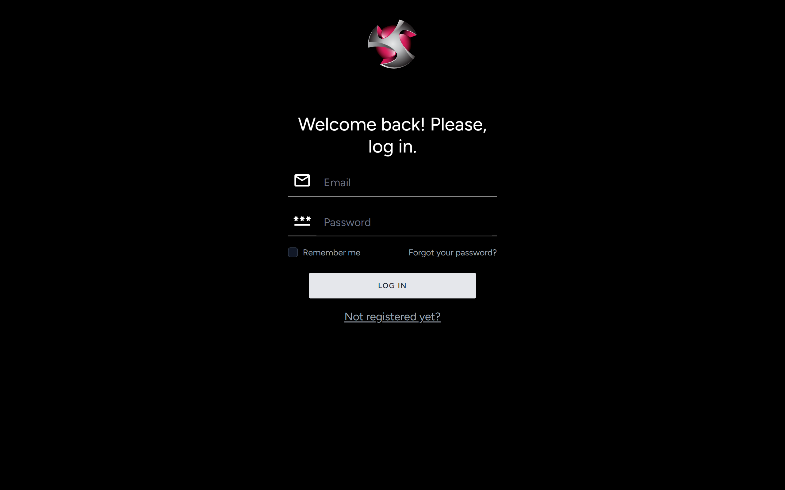
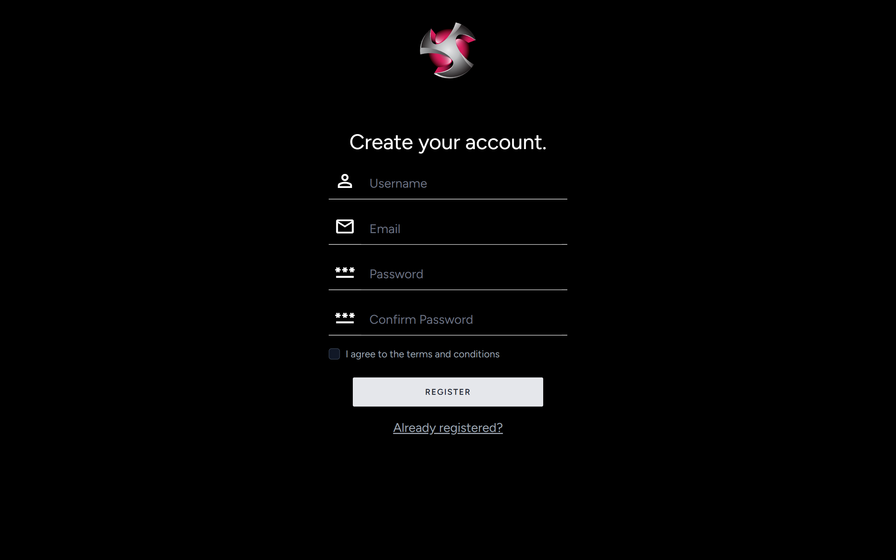
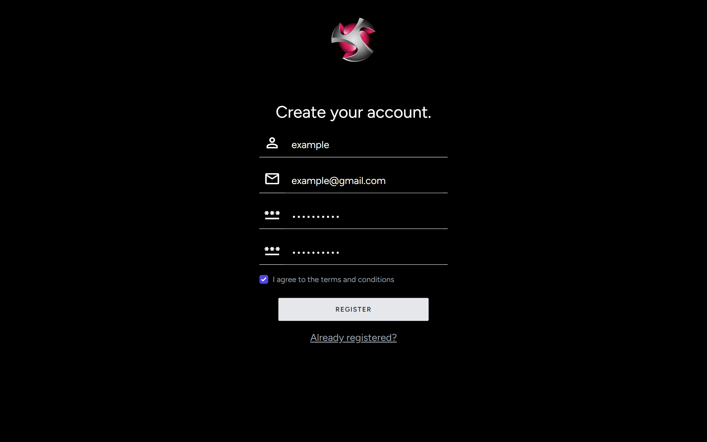
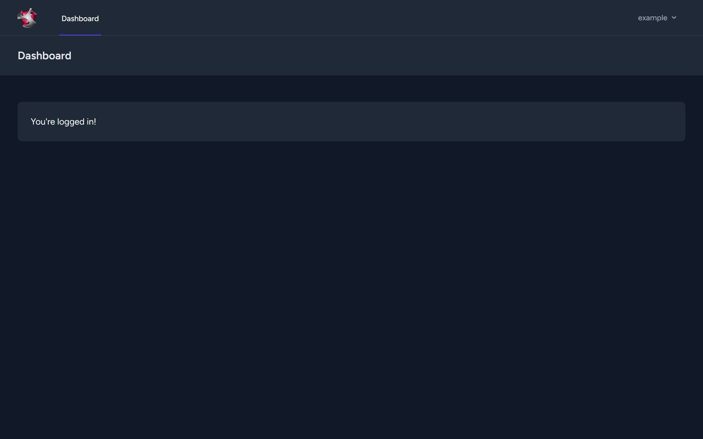
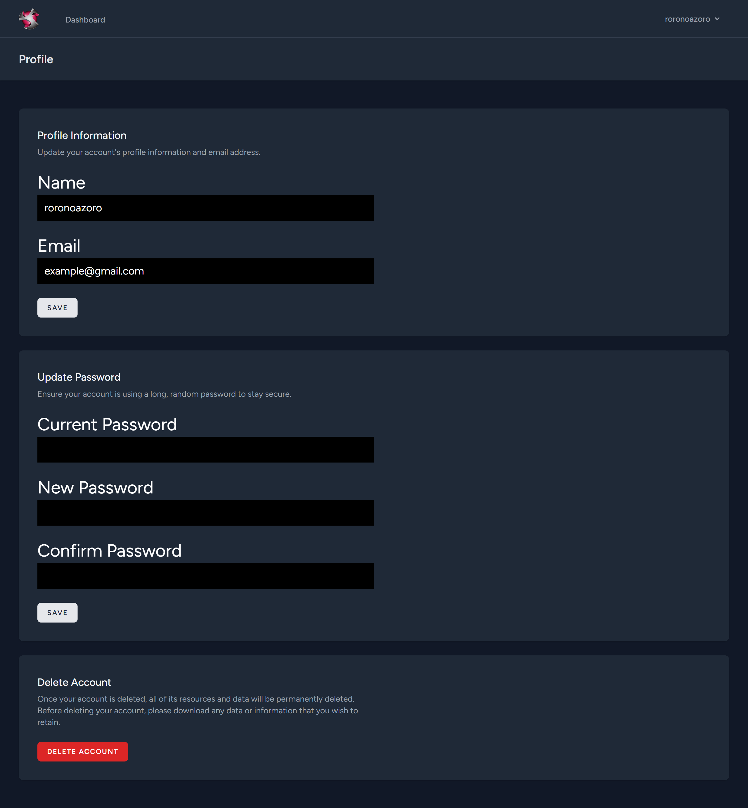
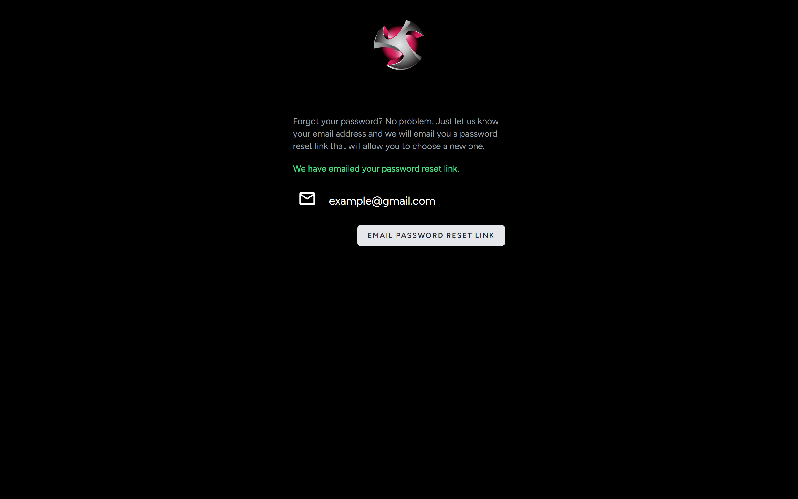
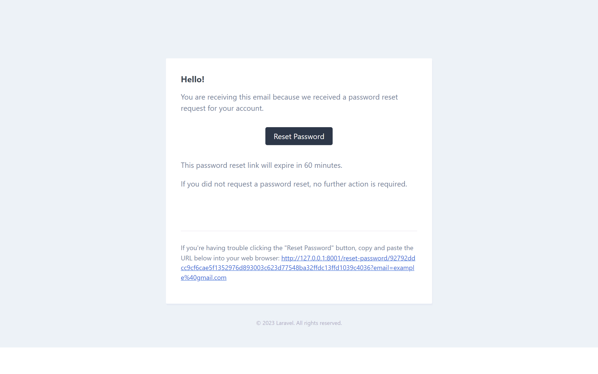
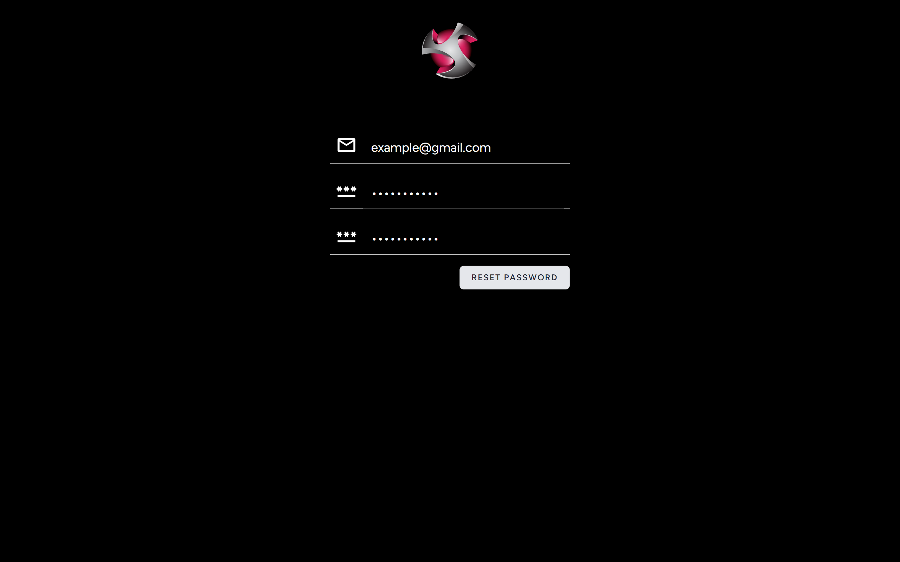

<h1>Laravel Authentication App</h1>
<h1>Preview: </h1>

Login form page. If user is already registered they can log in and see dashboard.

Registration form page. Anyone can register on the website.

Filled up registration form.

Logged In / Freshly registered user is redirected to dashboard.

On the profile page user can update information or delete their account.

Forgot password page. If email exists in the database password reset link is sent to the user.

Password reset email template, which is sent to user.

The user is redirected to this page using the password reset URL sent to them. After resetting password they're redirected to dashboard.

